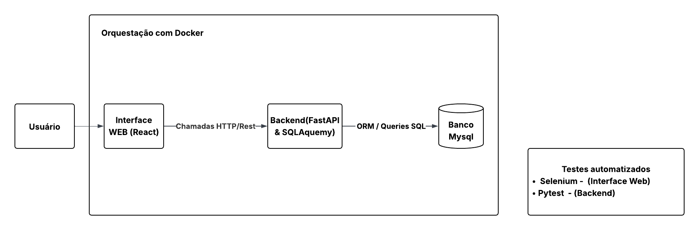
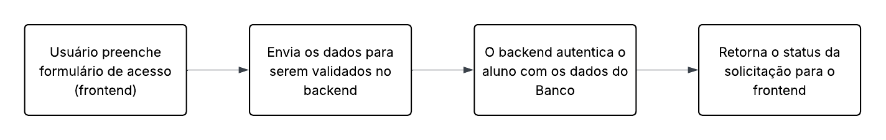
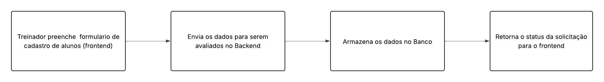
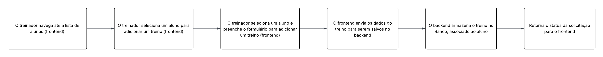

# Documento de Arquitetura – We Go Gym

## 1. Visão Geral
O **We Go Gym** é um sistema de gerenciamento de exercícos que permite cadastrar e gerenciar alunos e treinadores, além de controlar a relação entre eles. Este documento descreve a arquitetura de software do sistema, incluindo componentes, fluxos de dados e decisões técnicas.

---

## 2. Objetivos do Sistema
- Permitir que treinadores cadastrem e gerenciem  alunos de forma eficiente.  
- Permitir que alunos  acessem informações de seus exerciícos e observem sua evolução.  
- Garantir persistência dos dados, desempenho e facilidade de manutenção.  

---

## 3. Requisitos de Arquitetura

### Funcionais (derivados do backlog)
| ID   | Requisito                                    | Usuário       |
|------|---------------------------------------------|---------------|
| US01 | Cadastro de alunos                           | Treinador     |
| US02 | Edição de dados de alunos                    | Treinador e Alunos    |
| US03 | Remoção de alunos                            | Treinador     |
| US04 | Cadastro de treinadores                      | Administrador e Usuário interessado |
| US05 | Cadastro de Treinos                          | Treinador     |
| US06 | Inclusão de exercícios aos treinos               | Treinador     |
| US07 | Acesso de alunos aos seus treinos              | Aluno
| US08 | Calcular seu IMC               | Aluno
| US09 | Persistência de dados                        | Administrador |
| US10 | Validação de login e autenticação            | Todos         |

### Não-funcionais
- Persistência em banco de dados relacional MySQL.  
- Sistema modular e escalável.  
- Testes automatizados com Pytest para backend.  
- Infraestrutura baseada em Docker para containerização de frontend, backend e banco de dados.  
- Frontend responsivo e acessível, desenvolvido em React.  

---

## 4. Diagrama de Arquitetura de Alto Nível

> **Descrição**:  
- A interface web (frontend), faz chamadas REST para utilizar os serviços do backend.  
- O backend utiliza o SQLAlchemy como camada de abstração para salvar e consultar dados no MySQL.  
- Há testes automatizados que validam o funcionamento das rotas da API e o funcionamento do frontend.  
- Todo o ambiente do sistema é executado em containers Docker.  

---

## 5. Componentes do Sistema

| Componente       | Tecnologia             | Responsabilidade                                           |
|-----------------|----------------------|------------------------------------------------------------|
| Backend         | FastAPI + SQLAlchemy | Lógica de negócio, APIs REST, validação e persistência    |
| Banco de Dados  | MySQL                | Persistência de alunos, treinadores e treino e exercícios            |
| Frontend         | React            | Interface do usuário, consultas, filtros e formulários        |
| Testes          | Pytest   + Selenium            | Testes automatizados do frontend e do backend           |
| Infraestrutura  | Docker               | Containerização do frontend, backend e banco de dados              |

---

## 6. Fluxos de Dados

**Acesso a Aplicação**  

**Cadastro de Aluno**  

**Cadastro de Treinos**  

**Visualisar Treinos**  

---

## 7. Decisões Arquiteturais

| Escolha Tecnológica        | Motivo                                                                 |
|----------------------------|------------------------------------------------------------------------|
| Backend em FastAPI         | Rápido, integração nativa com Python e suporte a testes automatizados |
| SQLAlchemy ORM             | Simplifica o mapeamento entre objetos Python e banco de dados         |
| MySQL                      | Gerenciamento de dados relacionais e execução de consultas complexas  |
| Docker                     | Automatiza a criação de ambientes consistentes, facilita deploy e escalabilidade |
| Testes com Pytest e Selenium | Pytest para lógica de backend e Selenium para testes de interface e integração |
| Frontend em React          | Criação de interfaces dinâmicas, reativas e componíveis               |

---

## 9. Histórico de Versão

|Versão|Data|Descrição|
|:----:|----|---------|
|`1.0`| 25/09/2025 | Criação do Artefato |
